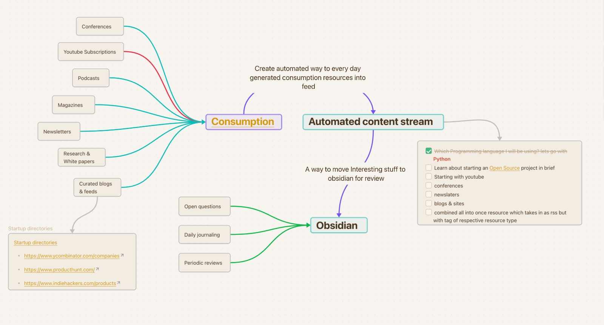

# 🪷 Kosha
**Fully Open Source Personalized Content Streamer**

---

## 🚀 Minimal MVP Roadmap (4–6 weeks)

### Week 0: Repo + Infra
- Scaffold monorepo (backend, frontend, connectors)  
- Docker Compose environment  
- Postgres + Redis + MinIO  

### Week 1–2: Ingestion + Storage
- Implement 3 connectors (RSS, YouTube, newsletters via Mailgun webhook or IMAP parsing)  
- Parse → clean → store core schema + raw content  
- Add transcript extraction for YouTube/podcasts  

### Week 2–3: Embeddings + Basic UI
- Hook in embedding model, store vectors in pgvector  
- Build simple React UI showing daily digest from last 24h  
- Add Obsidian export endpoint  

### Week 3–4: Feedback & Ranking
- Add explicit feedback API (save, highlight + reason)  
- Basic ranking: recency + source weight + embedding similarity  

### Week 4+: Iterate
- Add Celery tasks  
- Scheduled digest generation  
- Analytics dashboard  
- Begin gathering feedback for Phase 1 ML  

---

## ⚠️ Danger Zones & Mitigations

- **RLHF too early** → wait for high-signal feedback (≥ 500 explicit examples)  
- **Over-indexing content** → prune old vectors, compress, or store reduced embeddings  
- **Connector maintenance** → build adapters + monitoring/tests per connector  

---

## ✅ Quick Checklist to Start Coding (Actionable)

- [ ] Initialize repo + Docker Compose (Postgres, Redis, MinIO)  
- [ ] Define DB schema (users, sources, items, interactions, feedback)  
- [ ] Implement RSS & YouTube fetchers + HTML → Markdown parser  
- [ ] Add sentence-transformers embedding job and pgvector integration  
- [ ] Build FastAPI endpoints for digest and feedback  
- [ ] Minimal React UI to view digest, mark likes/highlights, export to Obsidian  

---

[Full Architecture Details](./architecture.md)

# Workflow

